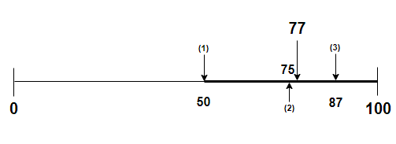

## **정렬과 탐색**

&nbsp;&nbsp;정렬은 주어진 일련의 데이터들을 일정한 규칙에 맞게 순서대로 나열하는 것을 의미하며, 주로 데이터를 효율적으로 탐색하기 위해 선행되는 작업입니다. 이번 글에서는 대표적인 정렬 방식 7가지에 대해 다루고 이들을 시간복잡도 별로 분류하여 그룹화하겠습니다.

</br>

### 시간 복잡도 별 정렬

**1. $O(N^2)$**

- [버블 정렬 (Bubble Sort)](./BubbleSort.md)
- [선택 정렬 (Selection Sort)](./SelectionSort.md)
- [삽입 정렬 (Insertion Sort)](./InsertionSort.md)

</br>

**2. $O(NlogN)$**

- [병합정렬 (Bubble Sort)](./MergeSort.md)
- [힙 정렬 (Heap Sort)](./)
- [퀵 정렬 (Quick Sort)](./QuickSort.md)
- [트리 정렬 (Tree Sort)](./)

</br>

### **이진 탐색 (Binary Search)**

<p align="center">
    
</p>

&nbsp;&nbsp;정렬된 데이터는 탐색 효율성에 많은 영향을 끼칩니다. 가장 두드러진 예가 <u>**이진탐색(Binary Search)**</u>인데 이진 탐색은 주어진 데이터 범위의 앞 또는 뒤쪽부터 차례로 확인해 나가는 <u>선형 탐색</u>과는 달리 매 탐색 마다 탐색 범위를 절반으로 줄여 간다는 특징이 있기 때문에 일반적인 탐색의 시간 복잡도가 $O(N)$이라면, 이진 탐색의 시간 복잡도는 밑이 2인 로그의 형태로 $O(logN)$입니다. 따라서 정렬을 활용하면 탐색의 효율성을 높일 수 있다는 장점이 있습니다.

</br>

> ❗ **이진 탐색의 선행조건**
>
> &nbsp;&nbsp;이진 탐색의 선행 조건은 탐색될 데이터 목록이 정렬된 상태여야 한다는 것입니다. 정렬이 되어있지 않은 데이터들은 이진 탐색을 통한 탐색이 불가능합니다.

<br/>

### **이진탐색 구현 (Java)** &nbsp;[[전체코드]](code/BinarySearch.java)

```java
/**
    이진 탐색으로 배열에서 목표값(target)의 인덱스를 반환
*/
public int binarySearch(int target, int left, int right) {
    int mid = -1;
    while (left <= right) {
        mid = (left + right) / 2;
        if (target > arr[mid]) {
            left = mid + 1;
        } else {
            if (target == arr[mid]) break;
            right = mid - 1;
        }
    }

    return mid;
}
```

<br/>
