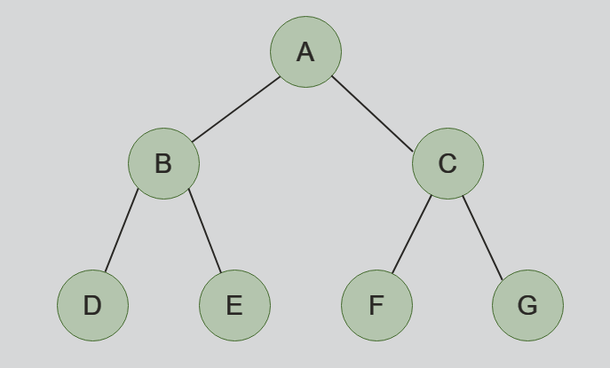

## 트리(Tree)

&nbsp;&nbsp;`트리(Tree)`는 그래프의 일종으로 그래프의 노드에 부모와 자식의 개념을 추가한 자료구조입니다. 부모-자식이라는 아이디어가 추가되면서 트리는 `계층(hierarchy)`구조를 가지며, 하나의 최상위 부모인 `루트(root)`노드를 가집니다.

 

### 트리 용어

**1. 루트(Root)**: 트리의 가장 위에 존재하는 노드입니다. 하나의 트리는 하나의 루트 노드를 가집니다.

**2. 리프(Leaf)**: 트리의 계층 구조에서 가장 아래에 위치하는 노드입니다. 루트 노드는 자식 노드를 가지지 않는 계층 최하단 노드를 가리킵니다.

**3. 안쪽 노드**: 루트를 포함하여 리프 노드를 제외한 노드를 의미합니다. 즉, 자식 노드를 가지는 모든 노드는 안쪽 노드입니다.

**4. 조상 노드**: 부모 노드를 포함하여 자신으로부터 위쪽 가지를 타고 마주칠 수 있는 모든 노드를 말합니다.

**5. 자손 노드**: 자식 노드를 포함하여 자신으로부터 아래쪽 가지를 타고 마주칠 수 있는 모든 노드를 말합니다.

**6. 레벨(Level)**: 루트 노드를 기준으로 얼마나 떨어져 있는지를 표현한 값입니다. 루트 노드의 레벨은 0입니다.

**7. 차수(Degree)**: 각 노드가 가지는 자식의 수를 `차수(degree)`라고 말합니다. `이진 트리(Binary Tree)`는 리프노드를 제외한 모든 노드가 2개의 자식 노드를 가지는데 "_모든 노드의 차수가 2인 트리_"를 `이진 트리`라고 표현할 수 있습니다.

**8. 높이(Height)**: 루트 노드로부터 가장 멀리 떨어져있는 리프까지의 거리(혹은 리프 레벨의 최대값)입니다.

**9. 서브트리(subtree)**: 트리 내부에서 한 노드를 루트로 정하고 그 하위의 노드로 이루어진 트리를 임의로 지정할 수 있습니다. 이러한 트리를 `서브 트리(subtree)`라고 부릅니다.

 

### 트리의 탐색

&nbsp;&nbsp;트리의 탐색은 크게 낮은 레벨부터 탐색해 나가는 `너비 우선 탐색`과 리프 노드의 끝까지 탐색하며 내려가는 `깊이 우선 탐색` 두 가지로 구분됩니다.

 

**1. 너비 우선 탐색(Breath-first search)**

<figure align="center">
  
</figure>

 

$$A \rightarrow B \rightarrow C \rightarrow D \rightarrow E \rightarrow F \rightarrow G$$

&nbsp;&nbsp;`너비 우선 탐색`은 낮은 레벨의 노드부터 방문하는 탐색방식입니다.

 

**2. 깊이 우선 탐색(Depth-first search)**

<figure align="center">
  
</figure>

 

&nbsp;&nbsp;`깊이 우선 탐색`은 하나의 리프노드까지 우선적으로 방문하는 탐색방식입니다. 이진 트리의 깊이 우선 탐색은 방문 순서에 따라 `전위 순회(preorder)`, `중위 순회(inorder)`, `후위 순회(postorder)`로 나뉩니다.

 

**2.1 전위 순회(Preorder)**

&nbsp;&nbsp;방문노드, 좌측 노드, 우측 노드 순서로 탐색하는 순회방식입니다.

$$ A \rightarrow B \rightarrow D \rightarrow E \rightarrow C \rightarrow F \rightarrow G$$

**2.2 중위 순회(Inorder)**

&nbsp;&nbsp;좌측 노드, 방문 노드, 우측 노드 순서로 탐색하는 순회방식입니다.

$$ D \rightarrow B \rightarrow E \rightarrow A \rightarrow F \rightarrow C \rightarrow G$$

**2.3 후위 순회(Postorder)**

&nbsp;&nbsp;좌측 노드, 우측 노드, 방문 노드 순서로 탐색하는 순회방식입니다.

$$ D \rightarrow E \rightarrow B \rightarrow F \rightarrow G \rightarrow C \rightarrow A$$