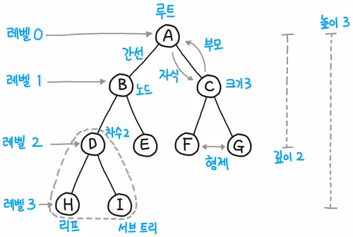
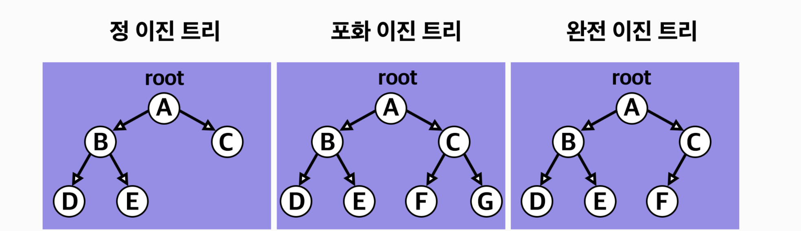

# 트리
계층형 트리 구조를 시뮬레이션하는 추상 자료형(ADT)으로, 루트값과 부모-자식 관계의 서브트리로 구성되며, 서로 연결된 노드의 집합이다.

## 트리의 구조

- 트리는 항상 루트에서부터 시작되는 단방향 구조
- 루트(Root)는 자식(Child) 노드를 가지며, 간선(Edge)으로 연결되어있음
- 자식 노드의 개수는 차수(Degree)라고 하며, 크기(Size)는 자신을 포함한 모든 자식 노드의 개수
- 높이(Height)는 현재 위치에서 리프(Leaf)까지의 거리
- 깊이(Depth)는 루트에서 현재 노드까지의 거리

## 그래프 vs 트리
***트리는 순환 구조를 갖지 않는 그래프***  
트리는 특수한 형태의 그래프의 일종이며, 어떠한 경우에도 한번 연결된 노드가 다시 연결되지 않는다. 이외에도 단방향, 양방향을 모두 가리킬 수 있는 그래프와 달리, 트리는 부모 노드에서 자식 노드를 가리키는 단방향 뿐이다.

## 이진 트리
- 트리 중에서도 가장 널리 사용도는 트리 자료구조는 이진 트리와 이진 탐색 트리(BST)
- 모든 노드의 차수(Degree)가 2이하인 트리를 **이진 트리**라고 한다.

### 이진 트리의 유형

- 정 이진 트리(Full Binary Tree): 모든 노드가 0개 또는 2개의 자식 노드를 갖는다.
- 완전 이진 트리(Complete Binary Tree): 마지막 레벨을 제외하고 모든 레벨이 완전히 채워져 있으며, 마지막 레벨의 모든 노드는 가장 왼쪽부터 채워져 있다.
- 포화 이진 트리(Perfect Binary Tree): 모든 노드가 2개의 자식 노드를 갖고 있으며, 모든 리프 노드가 동일한 깊이 또는 레벨을 갖는다. 문자 그대로, 가장 완벽한 유형의 트리이다.

## 이진 탐색 트리
노드의 왼쪽 서브트리에는 그 노드의 값보다 작은 값들을 지닌 노드들로 이뤄져 있는 반면, 노드의 오른쪽 서브트리에는 그 노드의 값과 같거나 큰 값들을 지닌 노드들로 이뤄져 있는 트리
- 시간 복잡도가 *O*(log*n*)

## 트리 순회
그래프 순회의 한 형태로 트리 자료구조에서 각 노드를 정확히 한 번 방문하는 과정
 
- L : 왼쪽 서브 트리, R : 오른쪽 서브 트리, N : 현재 노드
1. 전위(Pre-Order) 순회(NLR)
2. 중위(In-Order) 순회(LNR)
3. 후위(Post-Order) 순회(LRN)