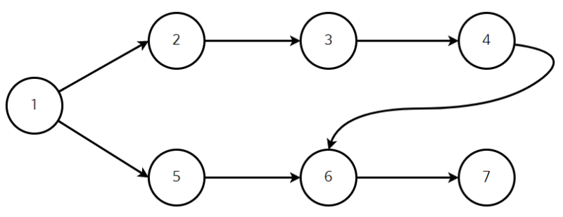
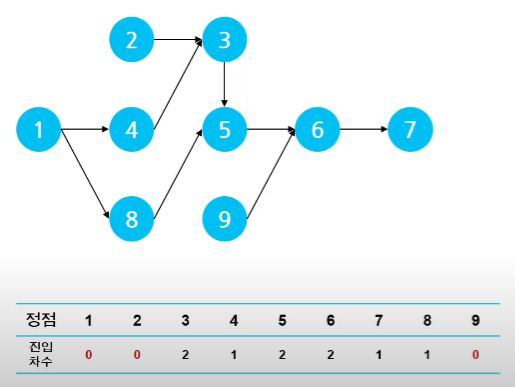

## 📄 **Topological Sorting(위상 정렬)**

    

 

&nbsp;&nbsp;순서가 있는 작업을 차례로 진행해야 할 때 순서를 결정하기 위한 알고리즘으로 <u>**사이클이 없는 방향 그래프(DAG)**</u>의 모든 노드를 주어진 방향성에 어긋나지 않게 순서를 나열하는 것입니다.

 

### 용어 정리

- **진입 차수(in-degree)** : 특정 노드로 들어오는 간선의 개수
- **진출 차수(out-degree)** : 특정 노드에서 나가는 간선의 개수

 

### 위상 정렬 과정

    

 

1. 진입 차수가 0인 노드를 시작 정점으로 큐에 담습니다.(복수 개의 시작 정점 가능)

2. 시작 정점에서 이어진 다음 정점의 진입 차수를 1 감소시킵니다.

3. 만약 2의 과정에서 차감된 진입 차수가 0이 되면 해당 노드를 큐에 담습니다.(다음 경로로 선택)

4. 위의 과정을 큐가 모두 빌 때까지 반복합니다.

 

### **함께 풀어보면 좋은 문제** : SW Expert Academy, 작업 순서
