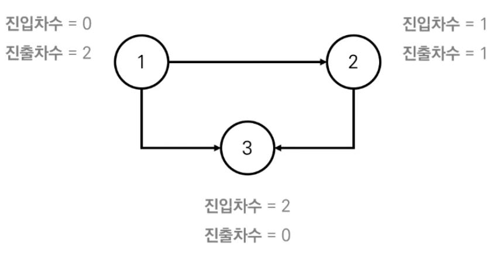

# 위상정렬

- 비순환 방향 그래프(DAG)의 모든 노드를 방향성에 거스르지 않도록 순서대로 정렬하는 알고리즘
- DAG가 아닌 그래프는 위상정렬이 불가능
- 모든 간선 (u, v)에 대해 정점 u가 정점 v보다 먼저 오는 순서로 정렬된다.
- 시간복잡도 : *O*(V+E) (V: 정점의 갯수, E: 간선의 갯수)

## 진입차수와 진출차수

- 진입차수(In degree): 특정한 노드로 들어오는 간선의 개수
- 진출차수(Out degree): 특정한 노드에서 나가는 간선의 개수

## 큐를 이용한 위상정렬의 동작과정
1. 진입차수가 0인 모든 노드를 큐에 넣는다.
2. 큐가 빌 때까지 다음의 과정을 반복
  a. 큐에서 원소를 꺼내 해당 노드에서 나가는 간선을 그래프에서 제거
  b. 새롭게 진입차수가 0이 된 노드를 큐에 넣는다.

- 결과적으로 **각 노드가 큐에 들어온 순서가 위상 정렬을 수행한 결과**와 같다.

## python 코드
```python
from collections import deque

# 노드의 개수와 간선의 개수를 입력 받기
v, e = map(int, input().split())
# 모든 노드에 대한 진입차수는 0으로 초기화
indegree = [0] * (v + 1)
# 각 노드에 연결된 간선 정보를 담기 위한 연결 리스트 초기화
graph = [[] for i in range(v + 1)]

# 방향 그래프의 모든 간선 정보를 입력 받기
for _ in range(e):
    a, b = map(int, input().split())
    graph[a].append(b) # 정점 A에서 B로 이동 가능
    # 진입 차수를 1 증가
    indegree[b] += 1

# 위상 정렬 함수
def topology_sort():
    result = [] # 알고리즘 수행 결과를 담을 리스트
    q = deque() # 큐 기능을 위한 deque 라이브러리 사용

    # 처음 시작할 때는 진입차수가 0인 노드를 큐에 삽입
    for i in range(1, v + 1):
        if indegree[i] == 0:
            q.append(i)

    # 큐가 빌 때까지 반복
    while q:
        # 큐에서 원소 꺼내기
        now = q.popleft()
        result.append(now)
        # 해당 원소와 연결된 노드들의 진입차수에서 1 빼기
        for i in graph[now]:
            indegree[i] -= 1
            # 새롭게 진입차수가 0이 되는 노드를 큐에 삽입
            if indegree[i] == 0:
                q.append(i)

    # 위상 정렬을 수행한 결과 출력
    for i in result:
        print(i, end=' ')

topology_sort()
```