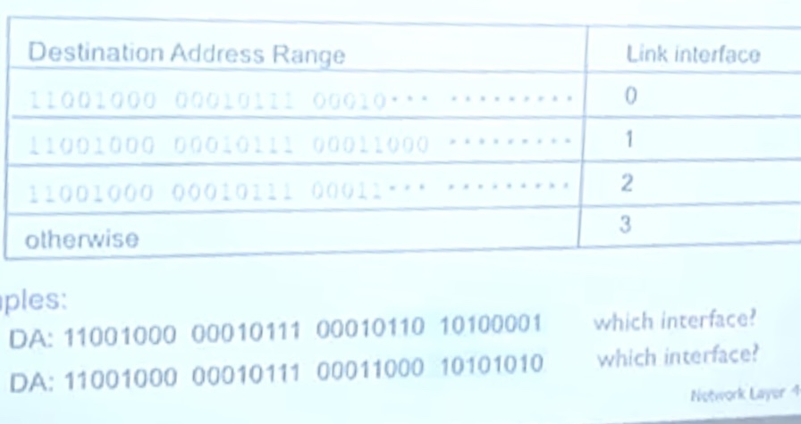
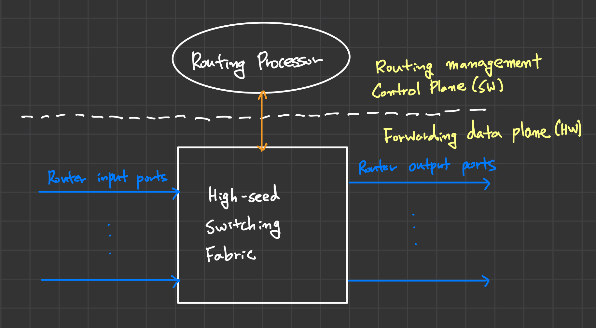
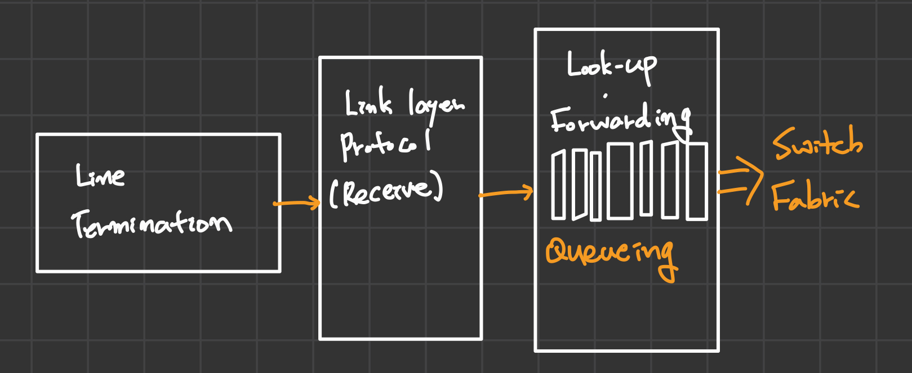

## 10. 네트워크 계층 1

&nbsp;&nbsp;네트워크 계층의 가장 대표적인 장비는 `라우터(Router)`이며, 라우터는 전달 받은 `패킷(Packet)`을 목적지까지 도달하기 위해 다음 경로(라우터)를 결정하는 `포워딩(Forwarding)`과 목적지까지 도달하기 위해 각 라우터별 `포워딩 테이블(Forwarding Table)`을 만들기 위한 방법인 `라우팅(Routing` 기능을 제공합니다.

&nbsp;&nbsp;현존하는 라우터는 네트워크 계층까지만 구현되어 있어 `애플리케이션 계층`이나 `전송 계층`의 `메시지`와 `세그먼트`에 대해서는 처리할 수 있는 기능을 가지고 있지 않습니다.

 

<figure align="center">
  
</figure>

> 💡 **포워딩 테이블 & Longest prefix matching**
>
> &nbsp;&nbsp;라우터는 `포워딩 테이블`을 통해 다음으로 보낼 라우터를 결정합니다. 모든 목적지에 대해 1대1로 테이블을 관리하는 것은 테이블의 크기가 너무 커질 수 있다는 문제가 있기 때문에 실제로 테이블에서 다음 목적지는 특정한 단위(ex.지역을 예시로 "~시 ~구")로 묶어 관리됩니다.
> 
> &nbsp;&nbsp;포워딩 테이블의 key는 `Destination Address Range`로 목적지의 주소가 key값의 앞자리(prefix)와 가장 길게 일치하는 라우터로 포워딩 됩니다.

 

### Router Architecture

<figure align="center">
  
</figure>

&nbsp;&nbsp;라우터는 크게 라우팅 알고리즘을 수행하는 SW 부분인 `Routing Processor`와 사용자 데이터들이 switching되는 `Switching Fabric`, 전달 받은 패킷이 `Forwarding Table`에 의해 분류되는 `input port`와 분류된 패킷이 빠져나가는 `output port`로 구성되어있습니다.

 

**Input ports**

<figure align="center">
  
</figure>

&nbsp;&nbsp;`input port`의 내부를 살펴보면 3가지 파트로 나뉘어집니다. Pysical layer인 `Line Termination`과 `Link layer` 2가지 파트는 이후 다룰 예정이므로 넘어가고, `Routing Processor`에 의해 만들어진 `Forwarding Table`을 가지고 파트가 있으며, 각각의 input port들이 테이블을 가지고 있어 분산된 방식으로 포워딩을 수행합니다.

 

### IP datagram(or packet) format

| No. | Field | desc. |
| --- | --- | --- |
| 1 | ver | IP version을 나타내는 필드입니다. |
| 2 | header length | 헤더의 크기를 나타냅니다. |
| 3 | type of data | - |
| 4 | identifier | packet fragmentation에 의해 쪼개진 패킷을 재조립하기 위한 필드입니다. |
| 5 | flags | packet fragmentation에 의해 쪼개진 패킷을 재조립하기 위한 필드입니다. |
| 6 | fragment offset | fragmentation을 위해 사용되는 필드입니다. |
| 7 | time to live | - 앞으로 몇 개의 홉(라우터)를 거칠 수 있는지 나타내는 필드입니다.   - 라우터는 패킷을 내보낼 때마다 이 필드의 값을 1씩 감소시킵니다.   - 잘못된 라우팅 알고리즘 등으로 인한 순환 발생 등 너무 많은 홉을 거치는 패킷을 드랍하기 위해 사용되는 필드입니다. | 
| 8 | upper layer | 전달받은 데이터를 열어 상위 계층(전송 계층)으로 보낼 때 어떤 프로토콜(TCP or UDP)로 보낼지 결정하기 사용되는 필드입니다. |
| 9 | length | 전체 datagram(packet)의 크기를 나타내는 필드입니다. | 
| 10 | checksum | 오류 발생 여부를 판단하기 위해 사용하는 필드입니다. |
| 11 | 32bit source IP addr | 메시지를 보낸 전송자의 네트워크 주소입니다. |
| 12 | 32bit dest. IP addr | 메시지를 받는 수신자의 네트워크 주소입니다. |

 

> 💡 **패킷 오버헤드(overhead)**
>
> &nbsp;&nbsp;일반적으로 IP 패킷의 오버헤드 크기는 TCP Segment의 헤더 크기인 20byte와 패킷의 헤더 크기인 20byte를 더한 `40byte`입니다.

 

### IP Address(IPv4)

- 독립적인 32bit 값을 사용하는 주소입니다.
- 알아보기 쉽게 dot('.') 기준으로 8bit씩 끊어 4개의 십진수로 구분된 000.000.000.000으로 표시합니다.

 

**Hierachical Addressing**

- 32bit의 주소는 아무렇게나 배정되는 것이 아니라 각 주소를 어느정도 계층으로 구분하여 관리합니다.
- 이를 통해 `Forwarding Table`의 크기를 줄일 수 있습니다.(IP Prefix)
- IP 주소 앞의 24bit는 네트워크 정보를, 뒤의 8bit는 host의 정보를 나타내며 '/'(slash) 뒤의 숫자는 앞의 몇 자리까지가 네트워크 정보를 담을 지를 의미합니다.(ex. 12.34.158.0/24)

 

**Classful Addressing**

| Class | desc | 호스트 개수 |
| --- | --- | --- |
| A | - 앞자리 비트가 `0*`으로 시작하는 주소입니다.   - /8로 앞의 8bit가 네트워크 주소, 나머지 24bit가 호스트 주소입니다. | $2^{24}$ | 
| B | - 앞자리 비트가 `10*`으로 시작하는 주소입니다.   - /16으로 앞의 16bit가 네트워크 주소, 나머지 16bit가 호스트 주소입니다. | $2^{16}$ |
| C | - 앞자리 비트가 `110*`으로 시작하는 주소입니다.   - /24으로 앞의 8bit가 네트워크 주소, 나머지 24bit가 호스트 주소입니다. | $2^{24}$ |
| D | - 앞자리 비트가 `1110*`으로 시작하는 주소입니다.   - /25으로 앞의 8bit가 네트워크 주소, 나머지 24bit가 호스트 주소입니다. | -|
| E | - 앞자리 비트가 `11110*`으로 시작하는 주소입니다.   - 이 주소는 미래에 사용할 목적으로 분리된 클래스입니다. | - |

 

> ❗ **Classless inter-domain routing(CIDR)**
>
> &nbsp;&nbsp;'.'(dot)로 구분된 주소 방식은 호스트의 개수를 제한적으로 사용할 수 밖에 없다는 단점이 있습니다. 때문에 최근에는 `Classless inter-domain routing(CIDR)` 방식을 통해 네트워크 주소와 호스트 주소의 구분을 명확하게 두지 않고 유연하게 사용합니다.
>
> &nbsp;&nbsp;`Classless inter-domain routing` 방식은 `IP Mask`를 통해 Network prefix와 host 주소를 구분합니다.

 

### Subnets

&nbsp;&nbsp;앞에서 설명한 `Network prefix`는 `Subnets`이라고도 부릅니다. Subnets을 이해하기 쉽게 표현하자면, Router를 거치지 않고 패킷이 이동할 수 있는 device interface가 가진 주소들의 집합입니다.

 

> 💡 **Interface**
>
> &nbsp;&nbsp;IP주소가 지칭하는 것은 사실 명확하게 표현하자면 `호스트(host)`보다는 인터페이스를 가리킵니다. 네트워크 인터페이스를 여러 개 가지는 라우터는 IP주소를 여러 개 가지고 있을 수 있으므로, IP와 Subnet 역시 인터페이스의 개수만큼 가질 수 있습니다.