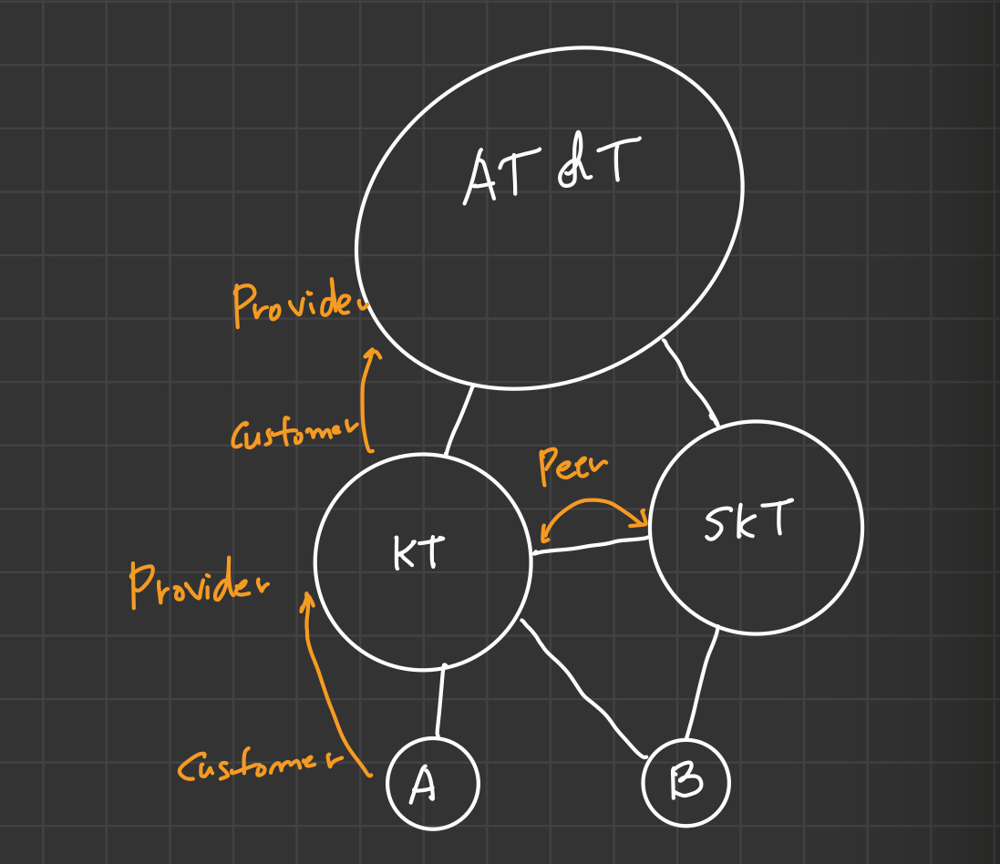
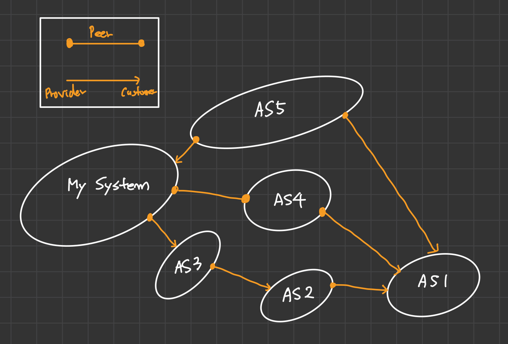

## 14. 네트워크 계층 5

&nbsp;&nbsp;앞서 살펴본 `Link state` 알고리즘이나 `Distance vector` 알고리즘을 전세계망에서 사용할 수는 없을 것입니다. 세상의 모든 라우터의 개수를 고려하면 그 개수가 너무 크니깐요.

 

**Hierachical routing**

&nbsp;&nbsp;이를 위해 사용하는 개념이 `Hierarchical routing`입니다. 네트워크를 보다 계층적으로 나누어 별도의 시스템으로 구분하는 것이죠. `Hierarchical routing`을 사용하게 되면 시스템 내부의 router 정보만 관리하면 되므로 결과적으로 routing table의 크기를 줄일 수 있다는 장점이 있으며, routing table을 업데이트하기 위한 traffic을 줄일 수 있습니다.

 

### IAS(Interconnected AS)

&nbsp;&nbsp;계층 구조에서 각 부분 시스템을 나타내는 것이 `AS(Autonomous System)`입니다. AS 내부의 라우팅은 시스템의 소유자가 `Link State` 알고리즘이든, `Distance vector` 알고리즘이든 소유자의 결정에 의해 달려있습니다. 이러한 그 다음 필요한 것이 AS간 라우팅을 하는 것인데, 이때 사용되는 프로토콜이 `BGP(Border Gateway Protocol)`입니다.

 

### Internet inter-AS routing: BGP

<figure align="center">
  
</figure>

**Broadcast**

&nbsp;&nbsp;A라는 AS가 B라는 AS로 도달하기 위해 연결 정보를 가지기 위해서는 자신의 위치를 Broadcast하는 과정을 거치게 됩니다. A는 자신의 위치를 상호연결된(interconnected) AS로 전달하고, 전달받은 AS는 다시 이를 `broadcast`합니다. 결과적으로 B는 A-KT-B라는 연결정보를 가지게 되고, A를 찾아가기 위해 KT라는 AS를 거쳐서 가겠지요.

 

**AS types**

&nbsp;&nbsp;다시 그림을 살펴보면 각 원은 AS로 각 시스템 소유주에 의해 관리되고 있습니다. 모든 AS는 서로 규모에 따라 서비스를 제공하는 `Provider`와 `Customer`로 구분할 수 있는데, 이는 상대 네트워크망을 필요로 하는 쪽이 자동으로 을의 입장이므로 `Customer`가 되고 `Provider` AS에 패킷을 주고받을 때마다 돈을 지불해야 합니다. 만약 둘의 관계가 서로를 필요로 하는 관계라면 서로를 패킷 이동에 대한 돈을 지불하지 않는 동등한 관계인 `Peer`로 정의합니다. 

&nbsp;&nbsp;만약 A라는 회사가 있고, 이 회사가 KT망(Provider AS)을 통해 다른 시스템과 통신하길 원한다면 보다 많은 인프라를 가지고 있는 KT가 자동으로 갑의 위치이기 때문에 A 회사는 KT에 돈을 지불하게 되는 것이죠.

 

**BGP Policy**

&nbsp;&nbsp;BGP에서는 항상 주변의 모든 AS에게 broadcast를 보내지 않습니다. 주변의 AS에 대해 `Provider`, `Customer`, `Peer` 관계를 파악하고 가장 자신에게 이득이되는 AS로만 broadcast를 보내죠. 아래 예시를 통해 살펴보겠습니다.

 

<figure align="center">
  
</figure>

&nbsp;&nbsp;만약 자신이 관리하는 시스템이 있다고 가정하겠습니다. AS1의 broadcast에 의해 AS5, AS4, AS3를 거쳐 연결 정보가 도달했다면 이후 패킷을 보낼 때 어느 경로를 선택할까요?

&nbsp;&nbsp;가장 짧은 경로는 AS5 또는, AS4를 거치는 경우겠지만 실제로는 AS3를 거치는 경로를 선택하게 됩니다. AS3를 통해 패킷을 전송할때, AS3는 자신의 Customer로서 돈을 지불하기 때문이죠. 만약 AS3가 없다면 Peer 관계인 AS4를 선택하게 될 것입니다.

$$Customer > Peer > Provider$$

&nbsp;&nbsp;이렇게 라우팅 알고리즘을 통해 가장 빠른 경로로 이동하는 AS 내부의 이동과는 달리 AS간의 패킷 이동은 빠른 경로를 통해 이동하지 않고, 각 AS의 이해관계에 따라 경로가 결정되게 됩니다.

 

### Difference btw intra-, inter-AS routing

**intra-AS routing**
- routing 알고리즘에 의해 가장 빠른 경로를 찾습니다.
- 하나의 관리자(System)에 의해 운영됩니다.

**inter-AS routing**
- 각 AS의 정책에 의해 좌우되며, 빠른 경로보다는 System의 관리자 입장에서 저렴한(또는 이득이되는) 경로를 우선적으로 선택합니다.

 

### Broadcast routing & Multicast routing

**1. Broadcasting**

&nbsp;&nbsp;현재 인터넷 환경에서 `Broadcasting`은 같은 서브넷 내부에 존재하는 모든 노드들에 한해서만 패킷을 보냅니다. 패킷을 보내는 방식에는 `source duplication`과 `in-network duplication` 등의 방법이 있는데 전자는 broadcast 패킷을 보내는 주체인 source가 모든 노드에게 각각 패킷을 보내기 때문에 비효율적인 반면, 후자의 경우 source는 인접한 라우터로 패킷을 보내고 broadcast 패킷을 받은 인접 라우터들이 다시 자신의 인접 라우터로 broadcast 패킷을 복제하여 전송하는 방식입니다.

 

> 💡 **in-network duplication**
>
> &nbsp;&nbsp;`in-network duplication`을 위해 제안된 모델에는 `flooding`, `controlled flooding`, `spanning tree`가 있습니다.
>
> &nbsp;&nbsp;`flooding`은 broadcast 패킷을 받은 router가 자신의 인접 라우터에 duplicate된 패킷을 모두 전달하는 방식입니다. 이 방식의 경우, 자신에게 broadcast 패킷을 보낸 router에도 복제된 패킷을 전달해 cycle이 발생할 수 있다는 단점이 있습니다.
>
> &nbsp;&nbsp;`controlled flooding`은 `flooding` 방식의 단점을 보완하기 위해 자신이 한번 broadcast한 패킷에 대해서는 이후 다시 broadcast하지 않는 방식입니다. 이 역시 broadcast된 노드에 중복된 패킷이 broadcast된다는 문제가 있습니다.
>
> &nbsp;&nbsp;`spanning tree`방식은 우선 노드들을 기준으로 트리를 만든 뒤, 트리의 간선 경로를 따라서만 broadcast하는 방식입니다. spanning tree를 만드는 과정은 우선 중심(`center`)이 될 노드를 하나 선정하고, 나머지 노드에 대해 중심에 가장 효율적인 경로로 이동하는 경로를 따라 트리를 구성하는 방식을 사용합니다.

 

**2. Multicasting**

&nbsp;&nbsp;`multicasting`은 모든 노드에게 패킷을 전달하는 `broadcasting`과 달리 `local multicast group`에 속하는 노드에만 패킷을 전달하는 방식입니다. multicasting 패킷을 전달하는 방식도 트리를 활용하는데 어떤 source든 이미 만들어진 하나의 트리를 활용하는 `shared tree` 방식과 각 source마다 별개의 트리를 활용하는 `source-based` 방식이 있습니다.

 

> 💡 **source-based tree**
>
> &nbsp;&nbsp;일반적으로 `source-based`가 `shared tree`에 비해 효율적이기 때문에 주로 사용되는 방식입니다. source-based는  `shortest path tree`와 `reversed path forwarding`의 두 가지 방식을 통해 구현되는데 간단히 살펴보겠습니다.
>
> &nbsp;&nbsp;`shortest path tree`는 source 노드를 기준으로 이전에 살펴보았던 `link state` 라우팅 알고리즘과 같이 다익스트라 기반의 최단 경로 알고리즘을 통해 트리를 생성하는 방식입니다.
>
> &nbsp;&nbsp;`reversed path forwarding`은 `shortest path tree`에 의해 생성된 트리를 활용해 받은 broadcast 패킷을 어떤 기준으로 forwarding할지 정의합니다. source로부터 시작된 broadcast 패킷을 받은 노드는 source로 가는 shortest path 방향 이외의 인접 라우터에게 모두 broadcast 패킷을 보내는데, 만약 다른 노드가 shortest path의 반대 방향(source로 이동하는 방향), 즉 reversed path가 아닌 노드로 부터 broadcast 패킷을 받았다면 이 패킷은 무시되고, reversed path인 노드로부터 받았다면 이를 다시 인접 노드로 broadcast합니다.
>
> &nbsp;&nbsp;`reversed path forwarding`이 끝나면 다시 multicast group이 아닌 노드들을 제거하는 `pruning`이라는 가지치기 과정을 거칩니다. 만약 broadcast를 받은 노드가 자신이 해당 multicast group에 속하지 않는다면 broadcast 패킷을 전달해준 노드로 자신은 해당 group이 아님을 알리고, 상위 노드는 이 노드를 제거합니다.