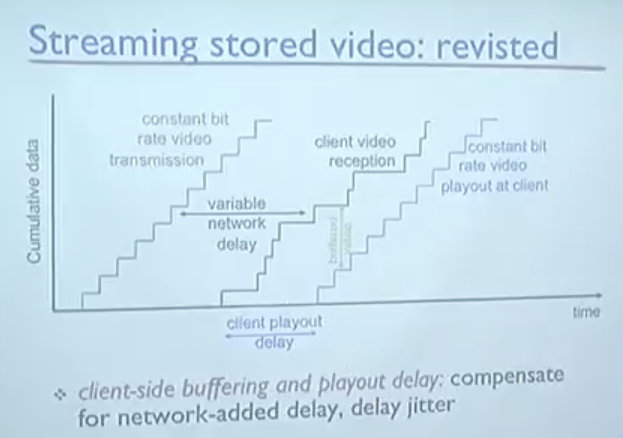

&nbsp;&nbsp;`Audio(오디오)`는 아날로그 데이터로 시간에 따라 진폭이 변화하는 일종의 파동의 형태를 지니고 있습니다. 오디오 데이터를 전송하기 위해서는 디지털 데이터로 변환하는 `인코딩(Encoding)`과정이 필요합니다. 시간에 따라 파동의 형태를 가지는 아날로그 데이터를 변환하기 위해서는 샘플링이 필요한데, 시간 축에 대해, 그리고 진동의 크기를 나타내는 `진폭(Amplitude)`를 보다 많은 데이터($2^8$, $2^
{16}$ 등)로 샘플링할 수록 보다 원음에 가까운 소리를 재현할 수 있습니다. 

**example rates**
1. Personal conversation: 64,000bps
2. CD: 1.411Mbps
3. MP3: 96.128.160kbps
4. Internet telephony: 5~6kbps

### Multimedia: Video

&nbsp;&nbsp;`Video(비디오)`는 이미지(frame)의 연속으로 이루어져있는 데이터로 마찬가지로 인코딩 과정에서 샘플링을 통해 디지털 데이터로 변환합니다. 하나의 프레임에 대해서는 프레임의 유사한 픽셀 별로 묶어서 압축하여 디지털 데이터화하며, 또한 다음 프레임과의 간격인 frame rate에 따라 더욱 매끄러운 비디오를 표현할 수 있습니다.

### 3 Application types

&nbsp;&nbsp;멀티미디어 네트워크 어플리케이션은 다음과 같이 크게 3가지로 구분할 수 있습니다.

1. Streaming, stored Audio & Video
2. Conversational voice/video over IP
3. Streaming live Audio & Video

 

### Streaming stored Video

&nbsp;&nbsp;서버에서 비디오를 전송하는 것은 초당 전송되는 크기가 고정되어 있으므로(ex. 10Mbps) 전송되는 누적데이터를 표현하면 위의 그래프처럼 일정한 계단의 형태로 그려지게 될 것입니다. 하지만 데이터를 보내는 과정에서 네트워크 상황에 따라 지연(delay)이 발생되게 되는데 이러한 현상을 표현하는 단어가 `jitter`입니다.

&nbsp;&nbsp;`jitter`로 인해 클라이언트에게 전송되는 비디오 데이터는 일정하지 않으며, 만약 초당 10Mbps의 frame을 실행해야 하지만 충분한 데이터를 전송받지 않음으로 발생하는 문제를 해결하기 위해 Client에서는 받은 비디오 데이터를 바로 실행하지 않고 `Buffer`에 비디오 데이터를 담으며 일정 시간 뒤에 실행하는 기법을 활용합니다. 충분한 데이터가 버퍼에 쌓였다면 클라이언트에서는 버퍼에서 비디오 데이터를 꺼내 실행하고, 충분한 데이터가 쌓이지 않았다면 사용자는 Buffering 화면을 보게 될 것입니다.

### Streaming Multimedia: TCP & UDP

그렇다면 사용자가 Youtube와 같은 서비스를 시청하면서 영상을 볼때, 서버에서는 어떤 프로토콜을 사용할까요?

&nbsp;&nbsp;우선 `TCP`를 사용하게 되면, 데이터의 유실을 방지할 수 있다던가 보내는 데이터의 순서를 유지하는 등의 장점이 있지만 한가지 큰 문제점이 있어 실제로는 사용되지 않습니다. `TCP`를 사용했을 때 가장 큰 문제는 전송 속도가 네트워크 상황(Network condition)에 의존하며, 서비스 제공자가 Application 단에서 전송 속도를 제어할 수 없습니다. 때문에 1Mbps로 인코딩된 영상을 실행해야 하지만 충분히 네트워크 상황이 좋지 않다면, 사용자는 데이터를 받기 위해 길게 기다려야 하는 시간이 발생합니다.

&nbsp;&nbsp;그렇다면 `UDP`는 어떨까요? 흔히 영상 데이터를 주고 받는데 `UDP`를 사용한다고 알고 있지만 `UDP` 역시 네트워크 상황이 좋지 않다면 UDP에 의해 네트워크에 밀어 넣어진 데이터에 수많은 유실이 발생할 것이고, 결국 사용자에게 충분한 데이터가 전달되지 못해 원활한 재생이 어렵습니다.

### Streaming Multimedia: DASH

&nbsp;&nbsp;기존의 프로토콜인 TCP와 UDP는 Timing 이슈에 대한 대응책을 제공해주지 않기 때문에 실제 서비스 기업들은 `DASH(Dynamic Adaptive Streaming over HTTP)`라는 독특한 기법을 사용하는데, `DASH`는 애플리케이션 계층에서 네트워크 상황에 의해 바뀌는 전송속도에 따라 보내는 데이터의 크기를 조절합니다.

&nbsp;&nbsp;우선 비디오 데이터는 하나의 큰 데이터가 아닌 `Chunk`라는 단위로 잘게 나뉩니다. 또, 같은 비디오라도 4K, FHD 등 비디오 데이터의 크기를 결정 짓는 요인들에 의해 서로 다른 크기(bps)를 갖도록 인코딩되어집니다. 클라이언트가 만약 X라는 비디오를 서버에 요청했다면 먼저 서버는 각 인코딩 정보와 Chunk들의 주소를 담은 `manifest` 파일을 클라이언트에 보냅니다.

&nbsp;&nbsp;만약 클라이언트가 좋은 화질(높은 bps)의 Chunk를 요청했는데, 네트워크의 상황이 좋지 않아 Buffer에 충분한 데이터를 받지 못했다면, 클라이언트 애플리케이션에서 구현된 기능에 의해 클라이언트는 낮은 화질의 Chunk를 요청합니다. 다시 네트워크 상황이 좋아졌다고 판단하면 높은 화질로 인코딩된 Chunk를 요청합니다. 이와 같이 네트워크 상황에 따라 동적으로 비디오 데이터를 요청하기 때문에 `DASH(Dynamic Adaptive Streaming over HTTP)`라는 이름을 가지고 있습니다.

 

### Content Distribution Networks

&nbsp;&nbsp;전세계에의 수많은 사용자는 유튜브를 통해 영상을 시청하고 있고, 인기가 많은 클립에 대해서는 동시간에 많은 사용자들로부터 요청을 받아 전송해주어야 할 때가 있습니다. 만약 하나의 서버에서 서비스를 제공하면, 요청이 한 곳(Point)으로 모이기 때문에 서버의 부하와 네트워크 이슈를 피할 수는 없을 것입니다.

&nbsp;&nbsp;이러한 상황을 해결하기 위한 방법이 `CDN(Content Distribution Networks)`입니다. 서비스 기업들은 복제된 클립을 가지고 있는 서버를 전세계에 분산해두고 사용자의 요청에 따라 가장 가까운 서버에서 비디오 데이터를 전송합니다.

