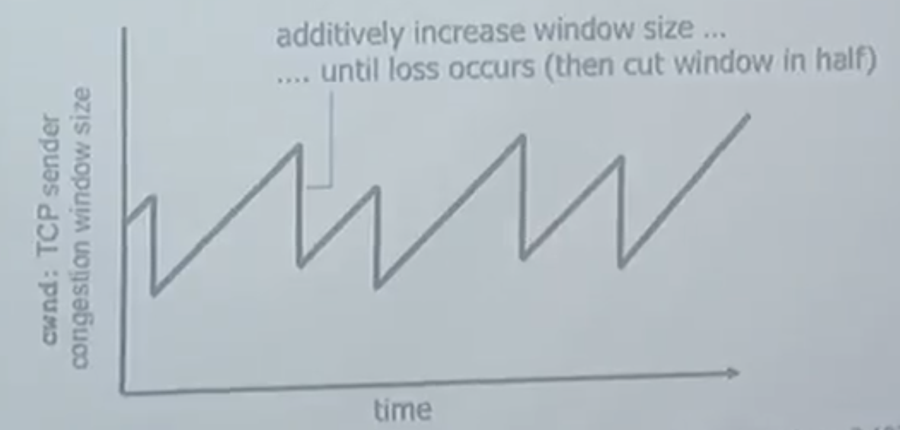

## 8. 전송 계층 4

### Congestion Control(TCP feature)

&nbsp;&nbsp;Sender가 보내는 세그먼트의 개수를 결정하기 위해서는 Receiver의 `RECV Buffer`의 여유 공간 외에도 네트워크의 상태를 확인해야합니다. Receiver의 응답으로부터 상태를 파악할 수 있는 Flow control와 다르게 네트워크의 상태를 직접적으로 확인하는 것은 어렵기 때문에 간접적인 방법으로 네트워크의 상태를 추측하는 방식을 사용해야합니다. 이제부터 간단한 시나리오를 확인하면서 네트워크의 상태가 데이터 전송에 어떤 영향을 미치는지, 고려해야 할 점은 무엇인지 확인해보겠습니다.

### Cause/cost of congestion: Scenario 1

<figure align="center">
  
</figure>

**가정**

1. 2대의 컴퓨터(Sender) A, B는 각각 2대의 다른 컴퓨터(Receiver) C, D에 데이터를 전송합니다.
2. 네트워크에는 1대의 라우터(Router)가 존재하며, 라우터의 버퍼의 크기에 제한은 없습니다.
3. Link capacity는 R입니다.
4. 패킷 유실이 발생하지 않으므로 재전송은 이루어지지 않습니다.

**Cost**

<figure align="center">
  
</figure>

 

$$ MaximumPerConnection Throughput = R/2 $$

 

1. Receiver에 도달하는 데이터의 양을 나타내는 $\lambda_{out}$(out-throuput)은 $R/2$에 수렴합니다.
2. 이상적인 모델임에도 데이터 전송속도($\lambda_{in}$) 증가에 따라 지연되는 데이터의 양도 증가합니다.

 

### Cause/cost of congestion: Scenario 2

<figure align="center">
  
</figure>

**가정**

1. 이제는 라우터의 버퍼 용량에 제한이 생겼습니다.
2. 라우터 버퍼가 가득 차있으면 Packet loss가 발생하며, 이 경우 Sender는 재전송을 하게 됩니다.
3. 재전송되는 데이터를 포함해 전송되는 데이터의 양은 $'\lambda_{in} \ge \lambda_{in} $로 표현됩니다.

**Cost**

1. 재전송되는 데이터가 발생하는 만큼 불필요한 전송(재전송)이 필요하게 됩니다.
2. 네트워크의 상태로 인해 성공적으로 데이터가 전송되었음에도 Time-out이 발생하여 재전송이 발생할 수 있습니다.

 

### Cause/cost of congestion: Scenario 3

<figure align="center">
  
</figure>

**가정**

1. 이제 2개 이상의 경로가 존재합니다.
2. 각 경로에는 라우터가 존재하며, 라우터의 버퍼 크기는 유한합니다.

**Cost**

1. 한 라우터에서 Congestion이 발생해 메시지가 유실되면 `Upstream`의 자원이 모두 낭비됩니다.(지나온 모든 라우터의 자원을 사용했지만 메시지는 전송에 실패했습니다)
2. 전송에 실패하여 재전송이 발생할수록 소모되는 자원의 양은 비약적으로 증가하게 됩니다.

 

### end-end congestion control

- end와 end, 즉 Sender와 Receiver만으로 네트워크 내부의 상황을 추측하여 congestion control을 하는 방식입니다.
- 대표적으로 additive increase/multiplicatice decrease 방식을 사용합니다.
    - 이전 전송에 대해 `ACK` 피드백을 받았다면 점진적으로 전송하는 데이터의 양을 증가시킵니다.
    - 만약 모종의 이유로 피드백을 받지 못했거나, time-out이 발생했다면 재전송과 함께 전송하는 데이터의 양을 절반으로 감소시킵니다.
    - 이때 전송하는 데이터의 양을 Congestion Window Size(`cwnd`)로 표현합니다.

<figure align="center">
  
</figure>

- Congestion은 특정 라우터에 의해 발생하는 일종의 병목현상으로 Congestion Control은 병목현상을 해결하기 위해 전송속도를 조절하는 과정입니다.
- 전송 속도는 다음 식과 같이 `cwnd`를 `RTT`(Round Trip Time)로 나눈 근사식으로 표현될 수 있지만, `cwnd`는 네트워크 상태에 따라 유동적으로 변할 수 있습니다.

$$rate \approx cwnd/RTT$$

 

### TCP Slow Start

&nbsp;&nbsp;그렇다면 `cwnd`의 초기 크기는 어떻게 결정될까요? 네트워크는 모두가 사용하는 공공자원이기 때문에 시작부터 큰 용량을 보내는 것은 바람직하지 않습니다. 때문에 `Slow Start`(실제로 느리진 않습니다) 방식으로 연결 초기에는 `cwnd`는 세그먼트 한 개부터 시작해 Congestion에 따라 조정됩니다.

 

**ssthresh(Slow Start Threshold)**

<figure align="center">
  
</figure>

&nbsp;&nbsp;실제로 `cwnd`는 하나로 시작해 하나씩 증가하지는 않습니다. Congestion이 발생할 수 있는 경험값인 `ssthresh` 이전에는 exponential하게 증가하다가, Congestion이 발생하지 않고 `ssthresh`에 도달하면 이후부터는 Congestion Avoidance 단계로 하나씩 점진적으로 증가시킵니다.

 

**TCP packet loss 판별과 TCP Tahoe & TCP Reno**

&nbsp;&nbsp;TCP에서 packet loss를 확인하는 방법은 `Duplicate ACK`와 `Time-out`입니다. 전자의 경우, 반환되는 ACK가 있는 만큼 네트워크 상황이 아주 나쁘지 않은 반면, 후자는 전송된 패킷이 Receiver에 전혀 도달하지 않을 만큼 네트워크 상황이 좋지 않음을 암시합니다.

&nbsp;&nbsp;초기 방식인 `TCP Tahoe`의 경우 Congestion에 의해 패킷 유실이 발생하면 다시 처음(Slow Start)부터 시작하고, loss가 발생한 `cwnd`의 절반 크기에 새로운 `ssthresh`를 설정해 linear하게 증가(Congestion Avoidance 진입)하는 반면, `TCP Reno`는 `Duplicate ACK`와 `Time-out`을 구별해 보다 Duplicate ACK에는 Congestion이 발생한 rwnd의 절반 크기에서 바로 Congestion Avoidance 단계에 진입하고, Time-out의 경우에는 `TCP Tahoe`와 동일하게 동작하는 방식입니다.

 

### TCP Throughput

&nbsp;&nbsp;`Throughput`은 단위 시간 당 Sender가 보내는, 또는 Receiver가 받는 패킷의 양을 가리킵니다. TCP의 전송속도는 Throughtput의 평균값을 의미하며, 전송되는 Window size가 $W/2$와 $W$ 사이에서 움직이므로 대략 $3/4 * W/RTT$로 계산할 수 있습니다.

 

### TCP Fairness

&nbsp;&nbsp;지금까지 Congestion Control은 자신의 TCP에서 모두를 위해 window size를 조절하는 방식으로 설명했습니다. 이렇게 개별적으로 동작했을 때 모든 사용자는 공평하게 자원을 사용할 수 있을까요? 아래 그래프를 살펴보겠습니다.

<figure align="center">
  
</figure>

1. 빨간 그래프를 보면 처음에 Connection1과 Connection2는 모두 전체 R이라는 자원 안에서 일부를 사용하고 있습니다. 초기에는 Connection1이 2보다 조금 더 많은 자원을 사용하고 있네요.
2. 이제 양측은 additive increasing을 통해 사용하는 자원을 증가시키는데 그래프를 따라 이동하다 자원의 양보다 더 많은 자원을 필요로 하게 되었을 때 Congestion이 발생하게 되고, Congestion Control에 의해 두 연결은 자원을 사용하던 양의 $1/2$만큼 줄입니다.
3. 두 연결은 다시 additive increasing을 통해 자원을 증가시키며, 또 다시 Congestion이 발생했을 때, 자원을 줄이며, 1,2번의 과정을 반복합니다.
4. 결과적으로 두 연결은 각각 $R/2$의 자원을 사용하도록 수렴하게 되며 두 연결은 공평하게 네트워크 자원을 활용합니다.

 

> ❗️ **TCP Fairness(more) : UDP**
>
> &nbsp;&nbsp;UDP는 Congestion Control을 지원하지 않습니다. 네트워크 상태에 상관없이 네트워크 상에 보낼 데이터를 밀어 넣습니다. 그만큼 UDP에서는 Reliablity하지 않으니 유실되는 데이터는 감수해야만합니다.

 

> ❗️ **TCP Fairness(more) : Connection Level**
>
> &nbsp;&nbsp;TCP의 Fairness는 어디까지나 동일한 Connection Level에서만 적용됩니다. 한 애플리케이션이 여러 연결을 가지고 있다면 더욱 많은 자원을 사용할 수 있겠죠.