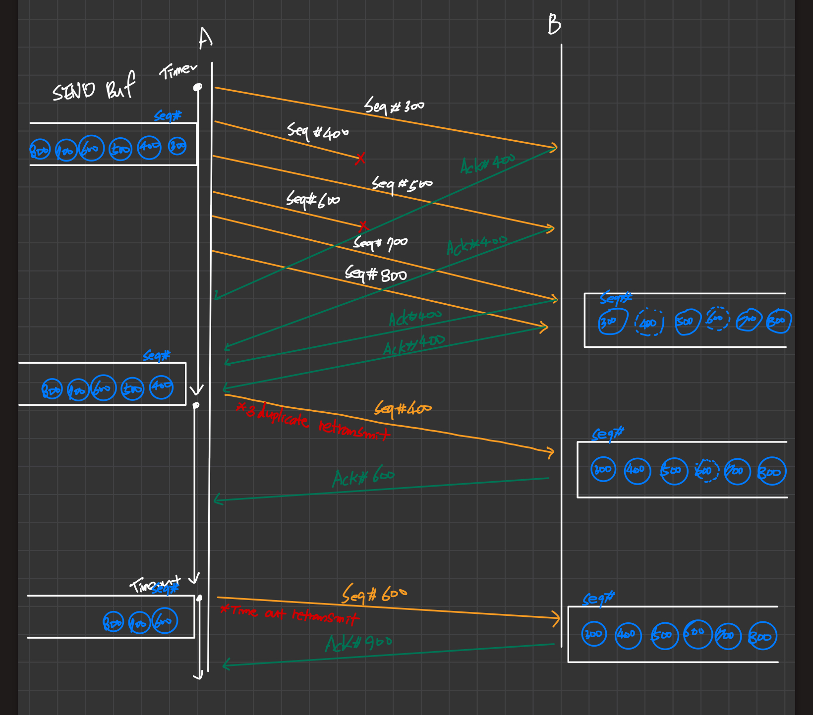

## 9. 전송 계층 5

&nbsp;&nbsp;앞서 다룬 애플리케이션/전송 계층에 대한 내용을 정리하고, 리마인드하는 강의입니다.

 

### Sample Problem

&nbsp;&nbsp;Draw a detailed packet-exchange diagram(e.g. seq#, ack#) until the reception of complete file.

- Assume that TCP connection has been established between A and B.
- Host A will transmit 600byte file.
- The seq# of the first data and firth data packets(from A)=300,500
- All data packets are 100byte.
- Window size=1000
- Retransmission timeout=500ms
- RTT=50ms
- Second data packet is lost.
- Host A uses fast retransmit.

 

**Answer**

<figure align="center">
  
</figure>