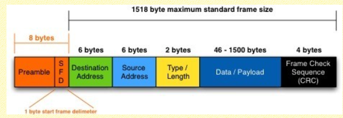

# 링크 계층2

## Ethernet(이더넷)

### bus : popular through mid 90s

-   all nodes in same collsion domain (can collide with each other)
-   즉 버스는 모든 노드가 같은 선에 있어 충돌 도메인이 같음.

### star : prevails today

-   active siwtch in center
-   each “spoke” runs a (separate) Ethernet protocol (nodes do not collide with each other)
-   즉 가운데 스위치가 존재해 서로 같은 프로토콜에서 충돌할 수가 없다.

### 이더넷 프레임의 구조

-   앞에 헤더 부분이 있고 뒤에 CRC라는 Link layer에서 발생할 수 있는 에러가 생겼는지 안생겼는지 에러 감지를 위한 것
-   데이터 부분이 가장 공간이 큼. ⇒ 이 부분에 들어 가는 것이 **IP 패킷**.
-   Type은 내가 이 프레임을 받았을 때 상위 계층으로 올려야 하는데 상위 계층에 누가 있는지 명시하기 위해 사용.
-   source 와 destination address는 IP 주소가 아니라 MAC address 주소.

### 이더넷에서 사용하는 MAC protocol인 CSMA/CD

-   말하기 전에 들어보고 누가 말하고 있으면 기다렸다가 조용해지면 다시 말하기 시작하는데 혹시 내가 이야기 하고 있는 중간에 충돌이 생기면 collision, detect 판단해 바로 중단.
-   그러고 새로 말을 할 시간을 랜덤으로 선택해서 말하기.
-   충돌을 감지하는 것이 아주 종요하다.
    -   왜? ⇒ 링크 계층에서는 피드백이 존재하지 않는다. 즉 내가 프레임을 보낸 거에 대한 피드백이 없음. 피드백을 안줘도 되는 이유는 케이블 자체가 외부로 부터 보호받고 있기 때문에 내부에서 충돌이 일어나지 않는다면 무조건 가는 것임.
-   혹시라도 충돌이 발생했는데 내가 감지를 못한 상황이있을까?
    -   A와 B가 있는데 A에서 B로 데이터를 전송하는데 B에 도착하기 직전에 B가 A에게 전송을 한다면 B는 collision detection 을 해 데이터 전송을 멈추게 됩니다. 그러고나서 A가 그 멈추기 전의 B의 데이터를 받는 A가 collision detection을 했을 땐 아무것도 없어 제대로 받게 됌. 이 경우 collision detection을 확인못함.
        -   이 경우를 대비하기 위해 minimum frame size가 존재함. 보통 64바이트임.
        -   만약 보낼 데이터가 적다면 뒤에 padding을 채워서 보낸다.
        -   이 길이를 통해 재전송을 판단한다.

### MAC addresses

-   MAC address는 어느 네트워크에 속하던 간에 변하지 않음.
-   48비트짜리 주소 공간이다.
    -   처음 24비트는 어느 회사에서 만들었는지, 2번째 24비트는 그 회사 제품중에 어떤건지를 나타냄.
    -   16진수로 나타냄.
-   컴퓨터가 다른곳으로 이동해도 IP주소는 바뀌지만 MAC address는 그대로.
-   링크 계층에서 주소를 쓰는 공간에 MAC address를 사용한다.
    -   Source address는 내 인터페이스의 MAC address를 사용한다.
    -   Destination address는 Gate way의 MAC address가 들어가야 한다.
        -   다음 홉의 누군지 알아야함. 이것을 포워딩 테이블을 이용하여 다음 홉의 IP 주소를 알아냄.
        -   우리가 dst에 적어야 할 것은 MAC address이므로 그것을 알아내야 보낼 수가 있다. ⇒ 즉 해당 IP주소에 해당하는 MAC address를 알아야하는데 이것을 알아내기 위해 **ARP** 라는 프로토콜을 사용한다.

### ARP

-   링크 계층내에는 ARP 테이블이 존재한다.
-   해당 IP에 해당하는 MAC address의 정보가 들어가 있다.
-   내가 찾고자 하는 MAC address가 있는지 확인하고 만약 없다면? ⇒ 서브넷 네트워크에 broad cast를 해줍니다. 이것이 ARP Query라고 함.
    -   이때 모두에게 프레임을 보내는데 이때의 dst는 broadcast 방식으로 보내므로 전부 1로 켜진상태로 보냄.
    -   찾으면 ARP response로 그에 대한 응답으로 source에게 전달해 MAC address를 알려주게 됩니다.
    -   위를 통해 이제 ARP 테이블에 등록할 수 있다.

결과적으로 도착지에 도착할때 까지 IP 패킷은 변하지 않고 링크 게층의 프레임의 정보들만 변하게 된다.

### Addressing : routing to another LAN

-   A 에서 B 로 전송을 하려 하는데 A와 B는 서로 다른 서브넷에 존재 합니다. 이때 라우터 R은 두개의 서브넷에 동시에 연결되어있어 인터페이스가 2개임.
-   A는 B의 IP주소를 알고있다.(DNS나 쿼리를 통해 알수있음)
-   A는 Gate way router의 IP주소를 알고있다.(DHCP Process를 통해 알수 있음)
-   A는 R의 MAC 주소를 알고있음.(ARP process를 통해 알수 있음)
    -   이때 A는 IP패킷을 만들텐데 source IP는 자기 자신의 인터페이스의 IP이고 dst는 B의 IP주소 일텐데 이것은 DNS 쿼리를 통해 알았을 것이다.
    -   링크계층에서 프레임을 만드는데 이때 dst 의 MAC adress는 Gate way의 MAC address를 써야하는데 이것은 포워딩 테이블을 보고 다음 홉을 판단하고 해당 IP 주소에 해당하는 ARP 테이블을 참조해 MAC address를 써서 프레임을 만들어줌.
    -   router에서는 해당 프레임에서 IP 패킷만 빼서 포워딩 테이블을 통해 다음 목적지로 위를 반복해 보내줍니다.
