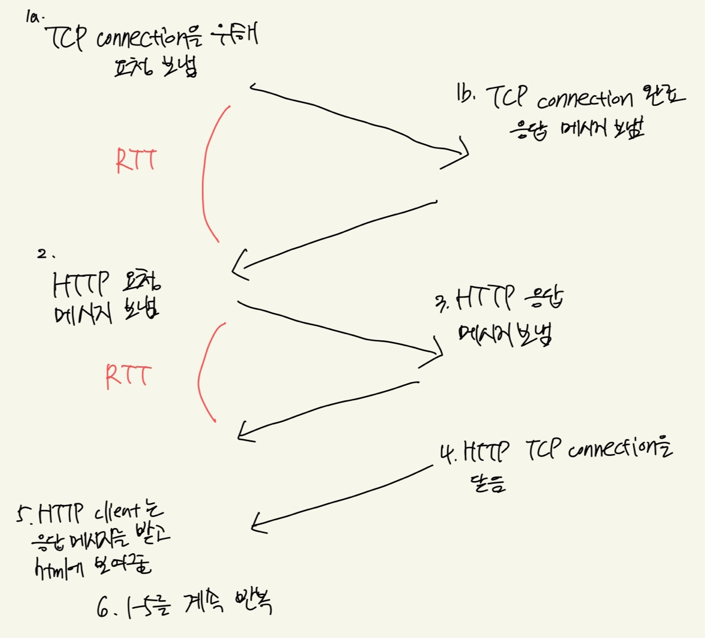
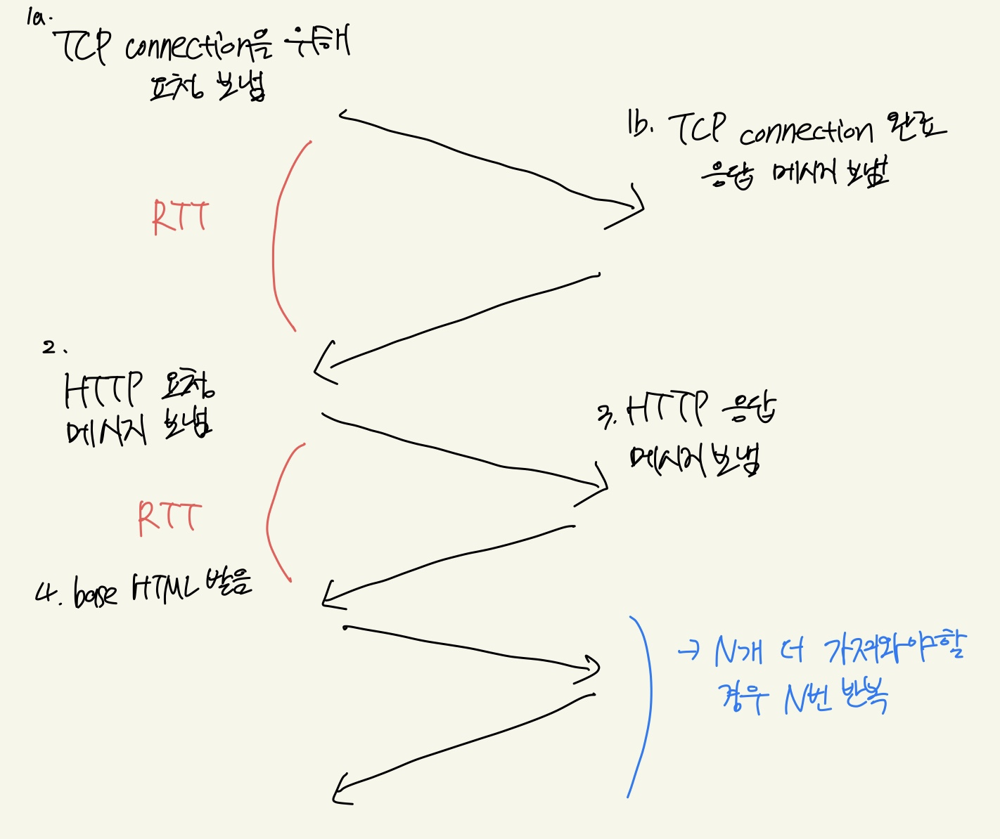

# 어플리케이션 계층1

## 네트워크 애플리케이션 (프로그램)

### Client - server 구조

**Server**

-   항상 켜져있음.
-   고정된 주소를 가지고 있다.

**Client**

-   내가 원할때 마다 서버에 요청을 함.
-   고정된 주소에 있을 필요가 없다.

### 소켓

-   OS가 마련해준 인터페이스.
-   우리가 원하는 메시지를 소켓으로 보냄.
-   다른 프로세스로 보내기 위해선 **IP 주소**와 **PORT 번호**가필요함.
    -   HTTP 서버의 기본 포트번호 80번
    -   mail 서버의 기본 포트번호 25번

### 전송할 때 네트워크가 제공해주는 서비스

-   보내는 메시지가 유실되지 않고 올바른 도착지에 도착하는 것만 제공.
-   security, timing 같은 것은 어플리케이션 계층에서 구현을 해주어야 한다.

### TCP service

-   신뢰성 있는 전송
-   받는 클라이언트의 능력에 맞게 보내줌 (flow control) ⇒ 즉, 보내는 양을 조절함.
-   네트워크 상황에 맞게 보내줌.
-   ex) email, remote terminal access, Web, file transfer, streaming multimedia, lnternet telephony

### UDP service

-   신뢰성 없는 전송
-   값이 저렴하다.
-   streaming multimedia, lnternet telephony

### Web과 HTTP

-   웹 페이지에 있는 정보를 가져오는 것.
-   HTML file, JPEG image, Java applet, audio file 등
-   웹 페이지는 HTML-file이 기초가 됌.

### HTTP : hypertext transfer protocol

-   웹 어플리케이션 계층 프로토콜
-   Client/server model
    -   client : 웹 오브젝트를 요청함.
    -   server : 웹 서버의 요청과 응답(오브젝트)을 보내줌.
-   TCP를 사용함.
    -   요청이 일어날 때 한번 만들고 해당 작업이 끝나면 끝. (**non-persistent HTTP**)
    -   한번 만들어 놓은 TCP를 계속 사용해 재사용 하는 방식. (**persistent HTTP**)
-   상대방의 상태에 대해서 아무것도 기억하지 않음.(HTTP 자체는 상대방의 HTTP에 대해 관심이 없다.)

RTT = 클라이언트에서 서버로 보낼 때 패킷이 돌아오는 시간.

**Non-persistent HTTP**

non-persistent HTTP response time = 2RTT + file transmission time

**Persistent HTTP**

-   HTTP message는 request, response 두가지가 존재함.

**request**

-   어떤 command인지? (get,post, head commands)
-   request line, header lines, body로 구성.

**response**

-   status line, header lines, data 로 존재.
-   status line에 status code에 200, 301, 400등 메시지가 온다.

    -   200 : OK
    -   301 : Moved Permantly
    -   400 : Bad Request
    -   404 : Not Found
    -   505 : HTTP Version Not Supported

-   cookie를 이용하여 상태를 기억
-   Web caches : (proxy server)
    -   사용자와 서버 사이 중간에 위치해서 사용자가 요청한 request에 대해서 대신 서버에 request를 전달 해주는 역할. 서버로 가져온 object를 가지고 있음. ⇒ 서버에 직접 가지않고 해당 요청이 왔을 때 서버를 대신해 응답을 줄 수 있음.
