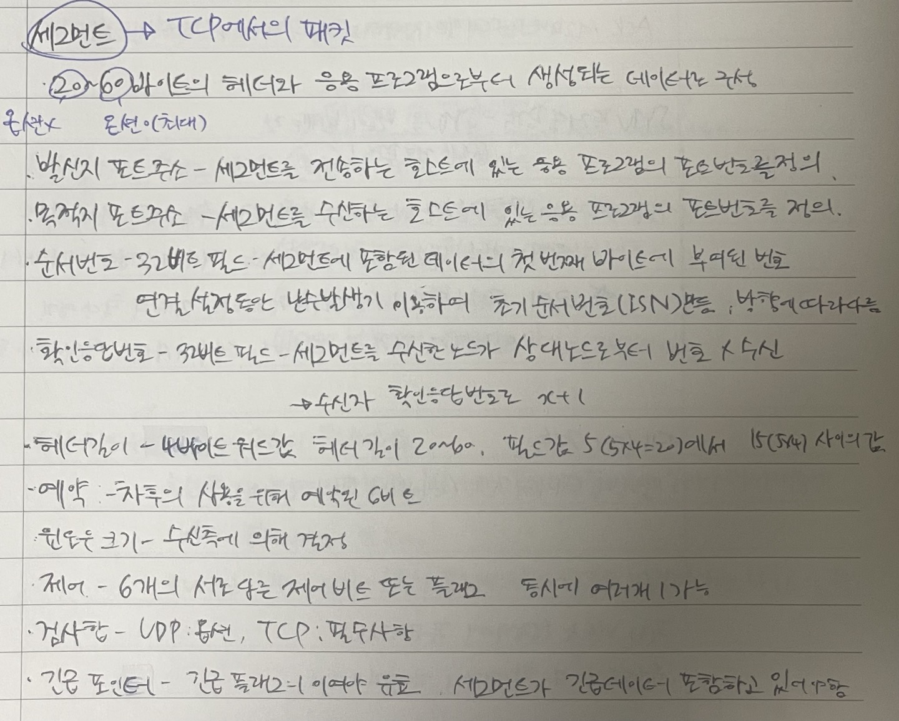

# 전송계층 2

### Reliable data transger(신뢰성 있는 데이터 전송)

2.2 NAK 없이 똑같은 기능을 구현할 수 있다.

-   무조건 ACK를 보내면서 마찬가지로 sequence number를 보냄. - 즉 receiver가 마지막으로 내가 받은 sequence number를 보내 sender가 그것을 파악하여 제대로 보내졌는지 파악 가능.

    3.0 underline 네트워크에 에러가 존재하면서 패킷 유실까지 존재한다면?

-   패킷 유실상황을 극복하기 위해서 타이머가 필요하다.
    -   패킷 전송할 때 타이머를 세팅하고 타이머가 만료되기 전 feedback을 받으면 OK, 만약 받지 못한다면 문제가 발생했다고 인지.
    -   타이머의 값 설정은 어떻게? ⇒ “reasonable” amount of time for ACK 즉 정답이 없음.
    -   만약 타이머 시간안에 ACK가 오지않으면 재전송함. ⇒ 이때 ACK를 보내는 시간이 길어 재전송을 했는데 재전송 보낸 패킷의 ACK가 오기전에 이전의 ACK가 온다면 이전의 ACK가 왔으니 받고 다음 패킷 전송. (receiver 입장에선 중복된 패킷이 오게 됌. 중복된 것이 오면 버림.)
-   stop-and-wait operation
    -   패킷 하나를 보내고 receiver에게 ACK를 받을때 까지 케이블을 쓰지 않아 효율성이 떨어진다.
-   pipeline protocol (go-Back-N, selectice repeat)
    -   go-back-N은 sender측에서 여러개의 패킷을 전송하는데 receiver측에서 순서대로 받지 못한 패킷이 있다면 해당 패킷부터 다시 **재전송**하는 방식. (해당 패킷만 재전송 하는 것이 아닌 그 패킷을 **포함**한 **이후** 패킷 다시 재전송하는 것.)
    -   selective repeat은 receiver 측에서 받은 각각의 패킷들에 대해 ACK를 보내는 것. (go-back-N과는 다르게 내가 ACK를 받지 못한 부분에 대해서만 재전송하는 방식이다.)

## TCP

-   TCP는 point-to-point 방식이다.
    -   하나의 sender, 하나의 receiver
-   신뢰성 있고 순서대로 전송함.
    -   유실되지 않고 에러가 없음.
-   pipelined(한꺼번에 보낸다는 뜻.)
-   full duplex data
    -   sender, receiver가 구분되는 것이 아닌 각 프로세스는 **둘 다 될수 있음**.

### TCP 세그먼트의 구조

-   port number
    -   multiplexting, demultiplexing 에 사용.
-   sequence number
    -   duplicate 인지 아닌지 tracking 하기 위해 사용함.
    -   바이트 번호.(세그먼트 데이터의 첫번째 바이트의)
-   acknowledgement number
    -   **cumulative ACK**라고 표현하기도 함.
        -   TCP에서 ACK 10이다. ⇒ 나는 9번까진 다 잘받았다. 이제 10번을 기다리고 있다는 말.
        -   TCP는 **window size**만큼은 ACK없이 보낼 수 있다.
    -   TCP의 특징에서 말한 것 처럼 둘다 sender와 receiver가 될 수 있어 존재함.
        -   sender buffer는 유실 될 경우를 대비해 재전송을 위해 존재함.
        -   receiver buffer는 in-order-delivery를 위해 존재함.(순서대로 전송)
-   receive window
    -   receiver가 상대방이 받을 수 있는 능력에 맞게 보내주기 위해 필요.
-   etc..)

### TCP 에서의 타이머 세팅

-   너무 작게 잡아도 문제 너무 크게 잡아도 문제.
-   둘 사이의 RTT(Rount trip time)보다 조금 크게 잡으면 됌.
    -   RTT를 지속적으로 측정함. ⇒ 큐잉 딜레이가 계속 변화해서 항상 같을 순 없다.

### TCP의 신뢰성 있는 전송

-   보낼 데이터가 있으면 세그먼트를 만들어 시퀀스 넘버를 붙임.
-   보낼 때 타이머 세팅 안되어있으면 그 때 시작
    -   프로세스에는 하나의 타이머만 존재함. 하나의 세그먼트를 보내려하는데 타이머가 설정이 안되어있다면 그때 시작.
    -   ACK를 받을 때 마다 send buffer에 받은 애들 삭제 하며 sendbase를 이동시켜줍니다.
    -   ex) Seq = 92, 8바이트의 데이터를 전송하고 Seq = 100, 20바이트의 데이터를 전송하는데 receiver측 에서 둘다 데이터를 받았는데 ACK = 100은 유실되고 ACK = 120은 제대로 도착했다.
        -   이때 ACK = 120을 받았으니 send buffer에 92~119는 사라진다. 데이터를 제대로 받았기 때문에. ACK = 100을 안받아도 괜찮은 이유는 cumulative ACK 기 때문에 120이 와도 이전 데이터들이 잘 받았다고 확인함.
-   TCP의 ACK 동작.
    -   receiver가 sequence number를 잘 받았을 경우에 원래대로 라면 바로 ACK를 보내야 하지만 그러지말고 약 500ms정도 기다렸다가 ACK를 보내라. ⇒ 계속 데이터가 들어올 가능성이 있으니 어짜피 제일 마지막 ACK로 확인이 가능하므로 조금 늦게 보내도 됌. (권고사항)

### 타이머를 주지 않고 패킷 유실을 판단 할 수 있는 방법

-   데이터를 받지 않았으니 ACK를 내가 받아야 할 패킷의 번호로 보내줍니다.
    -   ex) 패킷이 1~7번 부터 보내야하는데 2번이 빠지고 1,3,4,5,6,7번이 들어온다면 ACK 2, 2, 2,2,2,2가 들어오게 됩니다. ⇒ duplicate ACK를 몇개 이상 받았을 때 타이머가 터지지 않았음에도 재전송을 하게 하는 것(**fast retransmission** 기법.)
