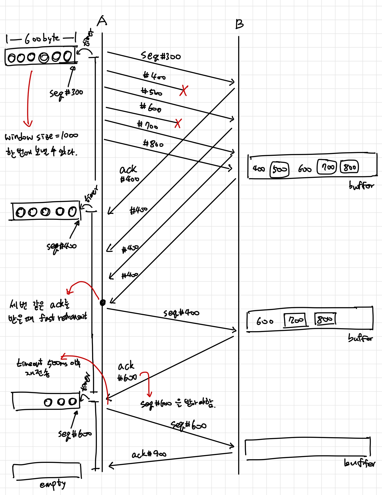

Sample Problem

Q. Draw a detailed packet-exchange diagram(e.g. seq#, ack#) until the reception of complete file.

Assume that TCP connection has
been established between A and B.

- Host A will transmit 600byte file.
- The seq# of the first data and firth data packets(from A)=300,500
- All data packets are 100byte.
- Window size=1000
- Retransmission timeout=500ms
- RTT=50ms
- Second, Fourth data packet are lost.
- Host A uses fast retransmit.

